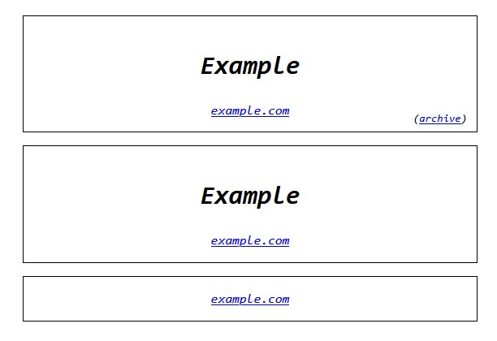
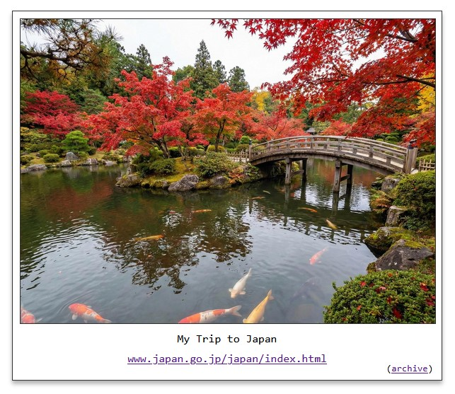

# jekyll-highlight-cards

A Jekyll plugin providing styled card components for links and images with Internet Archive integration.

## Features

- **``** - Styled link cards with optional titles and archive links
- **``** - Polaroid-style image cards with titles, links, and archive support
- **Markdown Image Sizing** - Extended syntax for image dimensions: ``
- **Internet Archive Integration** - Automatic lookup and archival for both tags
- **Customizable** - Override HTML templates and CSS styles

## Installation

Add to your `Gemfile`:

```ruby
gem 'jekyll-highlight-cards'
```

Add to your `_config.yml`:

```yaml
plugins:
  - jekyll-highlight-cards
```

Run:

```bash
bundle install
```

## Usage

### Linkcard Tag

Highlight links:



```liquid




```

**Parameters:**
| Parameter        | Description                                                      |
|------------------|------------------------------------------------------------------|
| URL              | (required, first parameter)                                      |
| Title            | (optional, everything after URL until `archive:`)                |
| `archive:URL`    | Explicit archive URL                                             |
| `archive:none`   | Disable archive lookup                                           |

### Polaroid Tag

Create polaroid-style image cards:



```liquid







```

**Parameters:**
| Parameter          | Description                                                                                              |
|--------------------|----------------------------------------------------------------------------------------------------------|
| Image URL          | (required, first parameter)                                                                              |
| `size=WxH`         | Image dimensions. Formats: `300x200`, `300x`, `x200`, `300`, `400pxx300px`                               |
| `alt="..."`        | Alt text for image (for accessibility)                                                                   |
| `title="..."`      | Title text displayed below image (also used as alt fallback)                                             |
| `link="..."`       | Explicit URL to link to                                                                                  |
| `archive="..."`    | Archive URL or `none` to disable                                                                         |

**Image Alt Text:**
The `alt` attribute priority: explicit `alt` parameter → `title` parameter → empty string.

This allows you to:
- Set accessible alt text without displaying a visible title
- Use title as both visual label and screen reader description
- Separate concerns: detailed alt for accessibility, brief title for display

**Link Display:**
- **No `link` parameter:** Image links to itself, no visible link text shown
- **With `link` parameter:** Image and visible link text both point to the specified URL

**Stacking:**

By default, the Polaroids are displayed centered in their available space. Two Polaroids in a row will be [stacked vertically](docs/polaroid-stacked-example.jpg).

If you want Polaroids to fill the available width [side-by-side](docs/polaroid-sidebyside-example.jpg), add the following to your `main.scss` file:

```css
.polaroid-container {
  display: inline-block;
  width: auto;
}
```

### Markdown Image Sizing

Add dimensions to Markdown images:

```markdown


```

Sized images are automatically wrapped in links to themselves.

## Configuration

### Internet Archive

Enable automatic archive lookup:

```bash
export JEKYLL_HIGHLIGHT_CARDS_ARCHIVE=1
```

Or in your shell config:

```bash
# In .bashrc, .zshrc, etc.
export JEKYLL_HIGHLIGHT_CARDS_ARCHIVE=1
```

### CSS Styles

Import defaults and override specific properties:

```scss
@import "highlight-cards";

.link-card {
  border-color: red;  // Override
}
```

The default style are structural only - they create the shapes but don't set colors, fonts, etc.
The recommended approach is to use the default styles and then add aesthetics to the provided classes.

### Template Customization

If the provided HTML structure doesn't work for you, you can override templates by creating files in your Jekyll site:

**Linkcard template:**
- Create `_includes/highlight-cards/linkcard.html`

**Polaroid template:**
- Create `_includes/highlight-cards/polaroid.html`

Templates receive these variables:

**Linkcard variables:**
- `url`, `display_url`, `title`, `archive_url`
- `escaped_url`, `escaped_display_url`, `escaped_title`, `escaped_archive_url`

**Polaroid variables:**
- `image_url`, `link_url`, `title`, `link_display`, `archive_url`, `width`, `height`
- `escaped_*` versions of all text fields

See default templates in gem's `_includes/` directory for examples.

## Examples

### Blog post with link card

```markdown
---
title: My Blog Post
---

Check out this cool site:



More content here...
```

### Gallery with polaroids

```markdown
---
title: Photo Gallery
photos:
  - url: /assets/photo1.jpg
    title: Sunset
  - url: /assets/photo2.jpg
    title: Mountains
---


  

```

### Sized images in Markdown

```markdown
Here's a large image:


And a smaller one:


```

## Development

See [CONTRIBUTING.md](CONTRIBUTING.md) for development setup and guidelines.
