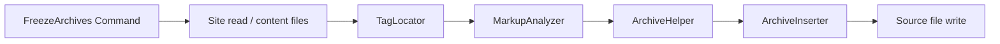

# Architecture Decision: Source Scan & Rewrite

## Requirements & Constraints

**Functional:**
- Find `linkcard` / `polaroid` tags in site source that lack an encoded archive
- Determine the archive target URL (linkcard URL; polaroid `link=` only)
- Look up IA and surgically insert the correct archive token into the source tag
- Skip: already has archive / `none`; non-archiveable URLs; polaroid without `link=`; targets that are Liquid expressions (not freezeable as literals)

**Quality attributes (ranked):**
1. Correctness / safety of source edits (must not corrupt markup)
2. Maintainability (stay in lockstep with tag syntax)
3. Simplicity
4. Performance (secondary — author runs occasionally)

**Technical constraints:**
- Ruby / Jekyll 4 plugin gem; reuse `ArchiveHelper` + #53 eligibility
- Tag syntaxes differ: `archive:URL` (linkcard) vs `archive="URL"` (polaroid)
- Existing tag classes own tokenizer/parser logic today
- Out of scope: build hooks, committing, resolving dynamic Liquid URLs

## Components



- **TagLocator**: finds `` / `` spans in file text
- **MarkupAnalyzer**: parses markup (shared with / extracted from tags); answers “has archive?”, “target URL?”, “eligible?”
- **ArchiveInserter**: inserts ` archive:…` or ` archive="…"` before the closing `%}` of that span only

## Options Evaluated

- **A — Regex-only locate + parse + rewrite**: Match tags with regex; ad-hoc parse/rewrite without sharing tag code
- **B — Locator + shared markup analysis + surgical insert**: Locate spans; reuse/extract tag markup parsers for decisions; insert archive token in-place
- **C — Full Liquid document parse / AST rewrite**: Parse documents as Liquid templates and mutate nodes
- **D — Rebuild entire tag markup from structured fields**: Parse to a struct, serialize a brand-new `` line

## Analysis

| Criterion | A Regex-only | B Shared + surgical | C Liquid AST | D Full rebuild |
|-----------|--------------|---------------------|--------------|----------------|
| Fitness | Fragile on quotes/Liquid | High | Overkill / poor Markdown mix | High but riskier diffs |
| Simplicity | Seems simple, isn’t | Moderate | Low | Moderate–low |
| Maintainability | Diverges from tags | Aligns with tags | Heavy | Must keep serializer sync |
| Risk | Corrupted source | Contained | High complexity | Larger noisy diffs |

Key insights:
- The hard part is *deciding* eligibility with the same rules as tags, not inventing a new language front-end — favors sharing parsers (B).
- Surgical insert preserves titles, quotes, and author formatting; full rebuild (D) creates noisy diffs for no product gain.
- Liquid AST (C) fights Markdown-mixed documents and buys nothing for one attribute insert.

## Decision

### Choice Pre-Mortem

- **Shared extract drifts from tag render path**: checked — plan requires extracting the existing tokenizers used by tags (single source), with tests covering both tag render and freeze analysis on the same markup fixtures
- **Regex locator misses multiline / odd whitespace tags**: checked — tags today are single-line in docs/usage; locator can allow `\s` inside markup but v1 may document single-line tags only if multiline proves painful; verify with fixtures before build
- **Literal-only skip is too narrow for real blogs**: checked as accepted scope — dynamic `{{ … }}` targets remain build-time fallback by design

**Selected**: Option B — Locator + shared markup analysis + surgical insert  
**Rationale**: Maximizes edit safety and syntax lockstep (top quality attributes) without Liquid AST complexity.  
**Tradeoff**: Small internal refactor to share/extract markup parsing from `LinkcardTag` / `PolaroidTag`; freeze skips dynamic URLs.

## Implementation Notes

- Extract markup tokenization/parse helpers (or a thin `Markup` module) used by both tags and the freeze analyzer
- Locator: per-file scan for tag name + markup + `%}`; process each match independently (must support multiline spans)
- Inserter token forms: linkcard → `archive:<url>`; polaroid → `archive="<url>"` (escape embedded `"` if needed)
- **Insert placement (formatting contract):**
  - **Single-line tag** (``): splice ` <token>` after the last non-whitespace of the markup, preserving any author whitespace before `%}`
  - **Multiline tag**: insert a **new line** immediately before the line that contains the closing `%}`, copying the indentation (leading whitespace) of the **last content line** inside the tag (the last non-empty line before the closer). Example:

    ```liquid
    
    ```

    becomes:

    ```liquid
    
    ```

  - Never rebuild or reindent existing lines; only add the archive line/token
- Skip when archive target contains Liquid delimiters or fails `archiveable_url?`
- Command orchestrates; no Generator registration
