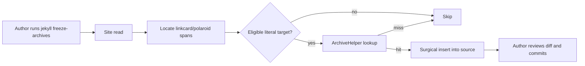

# Task: Freeze archive URLs via Jekyll subcommand

* Task ID: freeze-archives-jekyll-subcommand
* Complexity: Level 3
* Type: feature

Opt-in Jekyll subcommand `jekyll freeze-archives` that freezes Internet Archive URLs into source for archive-eligible `linkcard` / `polaroid` tags that lack `archive=` / `archive:none`.

## Pinned Info

### Freeze flow

End-to-end authoring flow (why pinned: orients every implementation step).

## Component Analysis

### Affected Components

- **Gem entrypoint** (`lib/jekyll-highlight-cards.rb`): load/register `JekyllHighlightCards::Commands::FreezeArchives`
- **FreezeArchives command** (`lib/jekyll-highlight-cards/commands/freeze_archives.rb`): `Jekyll::Command` with `init_with_program` — options `--dry-run`, `--save`; configure + `Site#read`; orchestrate freeze; print summary ([Jekyll commands plugin docs](https://jekyllrb.com/docs/plugins/commands/))
- **TagLocator** (`lib/jekyll-highlight-cards/freeze_archives/tag_locator.rb`): find tag spans in file text
- **MarkupAnalyzer** (`lib/jekyll-highlight-cards/freeze_archives/markup_analyzer.rb` or shared extract under `lib/jekyll-highlight-cards/`): parse markup using shared tokenizers; eligibility decisions
- **ArchiveInserter** (`lib/jekyll-highlight-cards/freeze_archives/archive_inserter.rb`): surgical insert of ` archive:…` / ` archive="…"`
- **Shared markup parse extract**: pull tokenizer/`split_markup` / polaroid parse helpers from tags into a shared module consumed by tags + analyzer (creative B)
- **ArchiveHelper**: reuse `archive_url_for` / eligibility; freeze path does not require `ARCHIVE=1`; `--save` / `_SAVE` gates SavePageNow
- **README / CHANGELOG**: document command + freeze-then-commit workflow; note CDX-without-`ARCHIVE=1` difference vs build

### Cross-Module Dependencies

- Command → site content files → Locator → Analyzer → ArchiveHelper → Inserter → filesystem
- Tags → shared markup module (refactor) → unchanged render via ArchiveHelper when unfrozen

### Boundary Changes

- New public surface: `jekyll freeze-archives` (Mercenary subcommand)
- Internal: extract markup parsing from tag classes (behavior-preserving refactor)
- No Generator / build-hook registration for freeze

### Invariants & Constraints

- Must not run as part of `jekyll build`
- Must not rewrite tags that already encode archive / `none`
- Must preserve #53 eligibility rules
- Must skip Liquid-dynamic archive targets
- Must not invent archive attributes on lookup miss
- Source write is the deliverable; tool does not commit
- Build-time env-gated auto-lookup remains fallback

## Open Questions

- [x] **Source scan & rewrite architecture** → Resolved: Locator + shared markup analysis + surgical insert; skip Liquid-dynamic targets (`creative-source-scan-rewrite.md`)
- [x] **CLI / env policy** → Resolved: `freeze-archives`; invoke enables CDX; SAVE via `_SAVE`/`--save`; write default + `--dry-run` (`creative-cli-env-policy.md`)

## Test Plan (TDD)

### Behaviors to Verify

**Shared markup / analyzer**
- A1 linkcard no archive, literal https URL → candidate with that URL
- A2 linkcard `archive:none` → skip
- A3 linkcard `archive:https://…` → skip
- A4 linkcard URL is `{{ page.url }}` → skip (dynamic)
- A5 polaroid with `link="https://…"` no archive → candidate
- A6 polaroid without `link=` → skip
- A7 polaroid `archive="none"` → skip
- A8 relative / archive.org target → skip (eligibility)

**Locator**
- L1 finds multiple tags in one file
- L2 ignores unrelated Liquid tags

**Inserter**
- I1 linkcard insert yields ` archive:<url>` before `%}`
- I2 polaroid insert yields ` archive="<url>"` before `%}`
- I3 preserves surrounding title/params

**Command / integration**
- C1 `--dry-run` with CDX hit → report planned edit, file unchanged
- C2 write mode with CDX hit → source updated; no `ARCHIVE=1` required
- C3 CDX miss → file unchanged
- C4 already has archive → unchanged
- C5 `--save` triggers SavePageNow path (WebMock) when CDX empty
- C6 `jekyll build` alone does not rewrite sources (regression: no Generator)

### Edge Cases

- Empty file / no tags → no-op summary
- URL with quotes in polaroid insert → escaped or safely quoted
- Multiple candidates in one file → all processed independently
- Cache: repeated URL in two tags → one lookup (ArchiveHelper cache)

### Test Infrastructure

- Framework: RSpec + WebMock (`bundle exec rspec`)
- Test location: `spec/jekyll_highlight_cards/`
- Conventions: describe/context/it; WebMock for archive.org; ENV isolation in `spec_helper`
- New test files: `freeze_archives_tag_locator_spec.rb`, `freeze_archives_markup_analyzer_spec.rb`, `freeze_archives_archive_inserter_spec.rb`, `freeze_archives_command_spec.rb` (names may nest under `freeze_archives/`)
- Existing: extend tag specs only if markup extract requires behavior-preserving moves

### Integration Tests

- Command against a temp Jekyll site fixture (minimal `_config.yml` + one post) covering C1–C5

## Implementation Plan

1. **Extract shared markup parsing (behavior-preserving)**
   - Files: `lib/jekyll-highlight-cards/linkcard_tag.rb`, `polaroid_tag.rb`, new shared module (e.g. `markup_tokenizer.rb` / `linkcard_markup.rb` / `polaroid_markup.rb`)
   - Changes: move tokenizers/parsers; tags delegate; existing tag specs stay green
   - Creative ref: `creative-source-scan-rewrite.md`

2. **MarkupAnalyzer (TDD)**
   - Files: analyzer + `spec/.../freeze_archives_markup_analyzer_spec.rb`
   - Changes: classify candidate vs skip for A1–A8 using shared parsers + `archiveable_url?`

3. **TagLocator (TDD)**
   - Files: locator + locator spec
   - Changes: return spans `{tag:, markup:, range:}` for linkcard/polaroid

4. **ArchiveInserter (TDD)**
   - Files: inserter + inserter spec
   - Changes: I1–I3 surgical insert

5. **FreezeArchives command (TDD)**
   - Files: `lib/jekyll-highlight-cards/commands/freeze_archives.rb`, command/integration spec, require from `lib/jekyll-highlight-cards.rb`
   - Changes: `Jekyll::Command#init_with_program`; `--dry-run`, `--save`; site configure + read; wire locator→analyzer→`archive_url_for`→inserter; summary output
   - Creative ref: `creative-cli-env-policy.md`
   - Docs: [Jekyll custom commands](https://jekyllrb.com/docs/plugins/commands/)

6. **Documentation**
   - Files: `README.md`, `CHANGELOG.md` (Unreleased)
   - Changes: how to run, dry-run first, commit workflow, CDX-without-`ARCHIVE=1`, `--save` / `_SAVE`

7. **Verify**
   - `bundle exec rspec`; `bundle exec rubocop` on touched files

## Technology Validation

No new technology - validation not required. Uses existing Jekyll `Jekyll::Command` / Mercenary API already provided by the `jekyll` runtime dependency.

## Challenges & Mitigations

- **Markup extract breaks tags**: keep tag specs green before adding freeze tests; extract in step 1 only
- **Freeze vs `archive_enabled?`**: tags gate auto-lookup with env; freeze calls `archive_url_for` directly (already ungated) — document; do not weaken tag path
- **Site file enumeration**: use `Jekyll::Site` configure + `read` and walk pages/docs/posts that have paths under source; skip binary/theme gems
- **Quote escaping in polaroid archive URLs**: prefer double-quoted attr; escape embedded `"`; test edge case
- **Command discovery**: ensure command class is loaded when gem loads (require in entrypoint); gem must be in `:jekyll_plugins` (already true for consumers)

## Pre-Mortem

- **Plan assumed authors only use literal URLs; real corpus is mostly Liquid**: already accepted scope + build fallback; docs must say so explicitly (add to README step)
- **Treated freeze as needing `ARCHIVE=1`, shipping a no-op command**: covered by CLI creative + C2 test
- **Implemented as Generator “for convenience”**: forbidden by brief/invariants; C6 guards
- **Shared extract rewritten instead of moved, silent tag regressions**: step 1 requires existing suite green before freeze features

## Status

- [x] Component analysis complete
- [x] Open questions resolved
- [x] Test planning complete (TDD)
- [x] Implementation plan complete
- [x] Technology validation complete
- [x] Pre-Mortem complete
- [ ] Preflight
- [ ] Build
- [ ] QA
