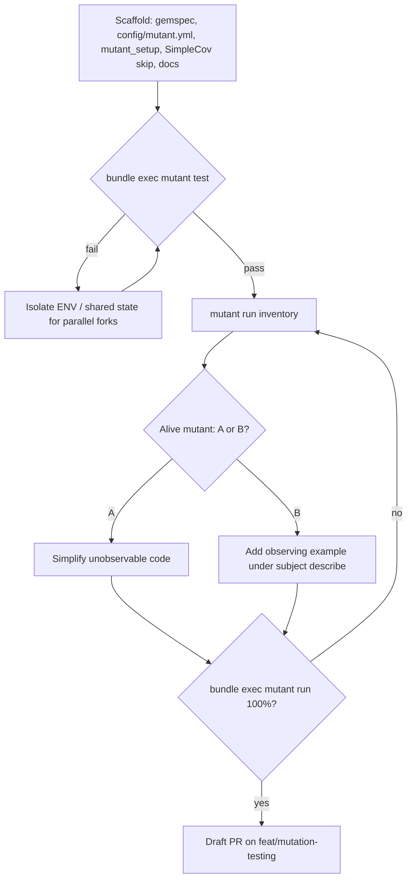

# Task: mutation-testing

* Task ID: mutation-testing
* Complexity: Level 3
* Type: feature

Wire Mutant + `mutant-rspec` into jekyll-highlight-cards using the jekyll-auto-thumbnails reference pattern, drive mutation coverage to 100%, open a draft PR on `feat/mutation-testing`. CI Mutant job out of scope.

## Pinned Info

### Mutant × RSpec kill loop

Scaffold first, keep `mutant test` green, then inventory survivors and kill by A/B buckets. No matcher ignores.

## Component Analysis

### Affected Components
- **Gemspec / Gemfile.lock**: declare `mutant` + `mutant-rspec` `~> 0.16` → done in PoC
- **config/mutant.yml + spec/support/mutant_setup.rb**: RSpec integration, subjects `JekyllHighlightCards*` → done in PoC
- **spec/spec_helper.rb**: SimpleCov skip when Mutant loaded; archive ENV isolation around hook → done in PoC
- **CONTRIBUTING.md**: Mutation Testing section (A/B, constraints) → pending
- **memory-bank/techContext.md**: Testing Process Mutant CLI note → pending
- **lib/** (kill loop): `DimensionParser` (`module_function`), `ArchiveHelper`, `ExpressionEvaluator`, `TemplateRenderer`, `LinkcardTag`, `PolaroidTag`, `ImageSizingHooks`, entrypoint Sass hook, `VERSION` → pending kill work
- **spec/**: expand observing examples; prefer public `archive_cache=` over `instance_variable_set`; no SUT stubs

### Cross-Module Dependencies
- Tags include `ArchiveHelper` / `ExpressionEvaluator` / `TemplateRenderer` / `DimensionParser`
- Mutant-rspec selects examples by describe-prefix match to subject expression
- Parallel Mutant forks amplify ENV and `@archive_cache` leakage

### Boundary Changes
- Public API unchanged for product consumers
- May convert `module_function :parse_dimensions` → `def self.parse_dimensions` (call sites already use module/include)
- May add small public helpers only if needed for Mutant observability (prefer not)

### Invariants & Constraints
- Must preserve RSpec green and ≥ project SimpleCov line coverage
- Must reach 100% mutation kill with no ignore / coverage_criteria cheats
- No `send`/`__send__` for private methods just for Mutant; no SUT stubs
- CI Mutant job is a non-goal

## Open Questions

None - implementation approach is clear (mirror auto-thumbnails archive `20260718-mutation-testing`).

## Test Plan (TDD)

### Behaviors to Verify

- Scaffold: `bundle exec mutant test` → all selected examples pass under Mutant
- Discipline docs exist and match A/B + constraints language
- Per surviving mutant (build): either simplify (A) or add observing example (B) until `mutant run` is 100%
- Known hotspots from reference:
  - `module_function` invents unused instance subjects → prefer `def self.`
  - Describe-local side-effect observations required
  - Shared ENV / cache must be isolated per example

### Test Infrastructure

- Framework: RSpec (`bundle exec rspec`, `.rspec`, `spec/spec_helper.rb`)
- Test location: `spec/jekyll_highlight_cards/*_spec.rb`
- Conventions: `RSpec.describe Module/Class` with nested `describe ".method"` / `"#method"`
- New test files: none expected; expand existing specs

### Integration Tests

- `mutant test` as integration gate for Mutant×RSpec harness
- Full `mutant run` as acceptance for kill coverage

## Implementation Plan

1. **Scaffold Mutant (PoC complete — no further TDD cycle)**
    - Files: `jekyll-highlight-cards.gemspec`, `Gemfile.lock`, `config/mutant.yml`, `spec/support/mutant_setup.rb`, `spec/spec_helper.rb`
    - Changes: deps `~> 0.16`; subjects `JekyllHighlightCards*`; SimpleCov skipped under Mutant; archive ENV around-isolation
2. **Document discipline (docs-only)**
    - Files: `CONTRIBUTING.md`, `memory-bank/techContext.md`
    - Changes: Mutation Testing section from auto-thumbnails; Testing Process Mutant CLI note
3. **Inventory survivors (observation-only)**
    - Run `bundle exec mutant run` (optionally JSON) once; group by structural cause before coding
4. **Kill loop — one subject/survivor cluster at a time (strict TDD)**
    - Files: matching `lib/` + `spec/` pairs for the current survivor cluster
    - Ordered substeps (must not skip ahead):
        1. Classify A vs B for the surviving mutant(s)
        2. If B: write/expand the observing example under the subject’s describe (expect fail or incomplete observation first)
        3. If A: no new test required — simplify the unobservable implementation
        4. If B after failing test: implement only enough product/test observation change to kill the mutant
        5. Re-run scoped `mutant run --fail-fast` / subject filter, then continue
    - Constraints while looping: prefer `def self.` over `module_function`; stub collaborators not SUT; no `send`/`__send__` for private methods just for Mutant
5. **Acceptance gates**
    - `bundle exec rspec` green
    - `bundle exec mutant run` 100%
    - `bundle exec rubocop` clean
6. **Draft PR**
    - Branch `feat/mutation-testing`; `gh pr create --draft` per github-open-a-pull-request rule

## Technology Validation

New dependencies: `mutant` 0.16.3 + `mutant-rspec` 0.16.3.

PoC results (2026-07-19):
- Install succeeds; `bundle exec mutant --version` → 0.16.3
- Initial `mutant test` failed 9/188 due to `JEKYLL_HIGHLIGHT_CARDS_*` ENV leakage across Mutant parallel workers from `archive_helper_spec` real-ENV mutations
- Fixed with RSpec `around` isolation in `spec/spec_helper.rb`
- Re-run: `bundle exec rspec` 188/0; `bundle exec mutant test` 188 success / 0 failed

## Challenges & Mitigations

- **ENV leakage under Mutant forks**: around-hook isolation of archive ENV keys (done in PoC)
- **module_function instance subjects**: convert `DimensionParser` to `def self.` if Mutant invents unused instance subjects
- **Describe-prefix selection**: place observing examples under the subject method's describe
- **SUT stubbing**: replace any SUT stubs with collaborator stubs / public API observation
- **Sass hook / VERSION subjects**: may need observing examples or Bucket A simplification

## Pre-Mortem

- **Plan fails because kill loop treats Mutant harness flakes as product mutants**: already covered by Challenge (ENV isolation) + green `mutant test` gate before inventory
- **Plan fails by adding matcher ignores under time pressure**: invariant forbids; acceptance requires full `mutant run` green with default criteria
- **Plan fails by underestimating tag/private-method surface**: inventory-first step batches by structural cause (per auto-thumbnails lesson) rather than pure `--fail-fast` linear thrash

## Status

- [x] Component analysis complete
- [x] Open questions resolved
- [x] Test planning complete (TDD)
- [x] Implementation plan complete
- [x] Technology validation complete
- [x] Pre-Mortem complete
- [x] Preflight
- [x] Build
- [x] QA
- [x] Reflect

## Preflight Findings

- **PASS** — Plan conventions match gemspec-owned deps + SimpleCov-in-spec_helper patterns; no creative docs required.
- **TDD encoding** — Amended kill-loop step 4 with explicit classify → test (B) / simplify (A) → implement → re-verify ordering.
- **Advisory (non-blocking)** — Optional `rake mutant` wrapper deferred (same as auto-thumbnails); CLI fidelity first.
